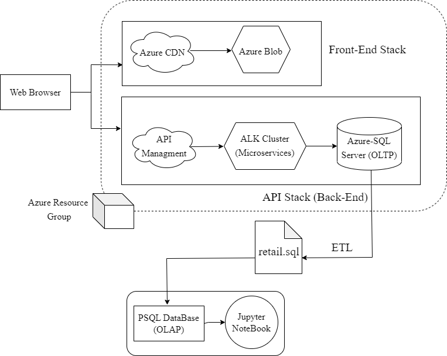

# Introduction

London gift shop, an online gift retailer has been running online shopping for 10 years, however, their revenue didn't grow recently. The company wants to use advanced analytics techniques to better understand its clients and come up with more effective business strategies. 
However, since LGS IT resources are limited for data analytics. LGS decided to ask Jarvis Consulting Company for assistance. The project is a proof of concept and it uses sample SQL data called retail data provided by LGS for analytics and monitoring the behavior of customers. 
The retail data is loaded into a PSQL DB which could be considered as a Data Warehouse used for data analyses. Next, analyses are performed using python in Jupyter Notebook. Especially, pandas library for storing (using DataFrames) and manipulating data. In addition, Matplotlib is used for plotting. The LGS marketing team uses these analytics results to come up with strategies for attracting more new and existing customers.

# Architecture

London Gift Shop (LGS) web applications are managed by Azure resource groups which consist of two parts of front-end and backend APIs. Frontend files are managed by a content delivery network (CDN). The backend APIs have a microservice architecture built by a cluster of containers. These containers are storing data in a Microsoft SQL server. For OLAP purposes the transactional data from the Microsoft SQL server is loaded into a PSQL database that is separate from the azure environment. Then the Jupyter Notebook is connected to PSQL to perform  analytics.

# Data Analytics and Wrangling

[Here](./retail_data_analytics_wrangling.ipynb) you can find the result of the data analytics. you can find the result of the data analytics. First, if we note the amount distribution for the first 85 quantiles we  observe that most of the invoices are below 400. Therefore, to attract customers we can offer bundle promotions below 400. In addition, according to Monthly Sales and Monthly placed charts the number of order and sale increased in November however then decreased dramatically in January and February. We could provide customers with financing options for these months. Moreover, we have a similar situation for the Monthly Active Users chart. The number of active users increased in November; however, later in January, this number decreased remarkably. To increase active users similarly we may provide financing options targeting active users.
 
Furthermore, if we note the result of RFM segmentation there are a considerable number of customers from groups 'Can't lose' or 'At risk'. We need to develop some marketing strategies similar to the one recommended, bundle promotions or financing options targeting these groups of customers, also we may contact them and let them know about these offers to decrease the risk of losing valuable customers.

# Improvement

1. Include product analytics and statistics by extracting related information from a description field  to come up with better marketing strategies.

2. Include visual representation for the consumers of each category in the RFM segmentation.  

